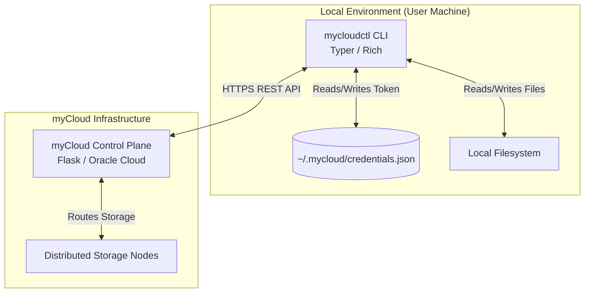

  
  <h1>myCloud CLI (mycloudctl)</h1>
  
<em>The official, high-performance command-line interface for the myCloud ecosystem.</em>

  

    <a href="https://pypi.org/project/mycloudctl/"><strong>PyPI Package</strong></a> |
    <a href="https://cloud.mysphere.co.in"><strong>myCloud Web</strong></a>
  

  
  
  

---

## Executive Summary

**mycloudctl** is the official command-line interface for **myCloud**. Built for power users, developers, and system administrators, the CLI provides seamless terminal access to the distributed myCloud storage platform. It translates complex API interactions into intuitive, fast, and secure terminal commands.

---

## Project Highlights

- **Terminal UI (TUI):** Beautiful, color-coded terminal interfaces built with `Rich`, featuring live progress bars, dynamic tables, and tree views.
- **Robust Argument Parsing:** Built on top of `Typer` for strict type-checking, intuitive subcommands, and auto-completion generation.
- **Asynchronous Operations:** Efficient handling of bulk file uploads, downloads, and batch sharing.
- **Standalone Binaries:** Available as a standard Python package via PyPI or as a zero-dependency standalone executable compiled with `PyInstaller`.
- **Node Management:** Native commands to register and manage your private myCloud storage nodes directly from the terminal.

---

## Overview

### What mycloudctl Does
`mycloudctl` allows users to perform all myCloud operations without leaving their terminal. From basic file operations (`ls`, `upload`, `download`, `rm`) to advanced ecosystem features (`stash`, `batch share`, `nodes`), everything is one command away.

### Target Users
Developers, Linux enthusiasts, and server administrators who prefer scriptable, keyboard-driven workflows over graphical interfaces.

### Core Philosophy
- **Speed & Efficiency:** Commands should be short, memorable, and execute instantly.
- **Visual Clarity:** Terminal output shouldn't be boring. `mycloudctl` heavily utilizes colors, emojis, and structured tables to make data readable.
- **Security:** Credentials must be handled securely via robust local authentication flows.

---

## System Architecture

The CLI acts as a thick client, managing local state and communicating with the myCloud Control Plane via a RESTful API facade.

### Architecture Highlights:
- **Authentication State:** `mycloud login` securely exchanges credentials for an API token, storing it in `~/.mycloud/credentials.json`. Subsequent commands automatically inject this token into the `Authorization` header.
- **Modular Command Groups:** Commands are grouped logically (e.g., `mycloud files`, `mycloud stash`, `mycloud share`) using Typer sub-applications for maintainability.
- **API Facade:** The CLI relies heavily on the `mycloud-sdk` core logic, serving primarily as a UI layer to translate user input into SDK function calls.

---

## Core Features & Commands

### File & Folder Management
Navigate your cloud storage as if it were a local directory.
- `mycloud ls [folder_id]` - Browse files in dynamic, color-coded tables.
- `mycloud upload <file> [--node <node_id>]` - Upload files with real-time progress bars.
- `mycloud download <file_id>` - Download files efficiently.
- `mycloud mv`, `mycloud rm`, `mycloud rename` - Standard POSIX-like commands.

### The Stash
Manage your hidden, temporary stash lifecycle.
- `mycloud stash add <id>` - Move a file to the stash.
- `mycloud stash ls` - View stashed files.
- `mycloud stash empty` - Permanently clear the stash.

### Sharing & Collaboration
Generate secure links and manage batch sharing groups.
- `mycloud share link <id>` - Generate a public URL.
- `mycloud batch link` - Create a bundle link for multiple files.

### Private Node Management
Manage your self-hosted storage nodes.
- `mycloud servers ls` - List connected nodes.
- `mycloud servers add` - Generate an API key to register a new machine.

---

## Technology Stack

| Category | Technology |
| --- | --- |
| **Language** | Python 3.10+ |
| **CLI Framework** | Typer (Click) |
| **Terminal UI** | Rich |
| **HTTP Client** | HTTPX |
| **Packaging** | PyInstaller, setuptools, build |

---

## Engineering Challenges

1. **State Management in Stateless CLI:** Designing an authentication flow that securely persists JWT tokens across isolated terminal command executions.
2. **Binary Compilation:** Configuring `PyInstaller` `.spec` files to properly bundle hidden imports dynamically required by `Typer` and `Rich`, ensuring the standalone `.exe` runs without Python installed.
3. **Chunked Transfers:** Implementing reliable, visually accurate progress bars using `Rich.Progress` while streaming large file uploads/downloads via `HTTPX` without loading the entire file into RAM.

---

## Repository Scope

> **IMPORTANT NOTICE:** 
> This repository is intended exclusively as a **project showcase and portfolio piece**. 
> 
> To protect proprietary business logic and the core source code, **the actual application logic is not published here**. This README serves to demonstrate the architectural design and professional standards applied during the development of the myCloud CLI.

---

## Contact & Links

- **Email:** kanhaiffco2007@gmail.com
- **LinkedIn:** [linkedin.com/in/rudransh-shekhar](https://linkedin.com/in/rudransh-shekhar)
- **Portfolio:** [rudransh-shekhar.netlify.app](https://rudransh-shekhar.netlify.app)
- **PyPI Package:** [mycloudctl](https://pypi.org/project/mycloudctl/)
- **Live Platform:** [cloud.mysphere.co.in](https://cloud.mysphere.co.in)
- **Ecosystem Hub:** [mysphere.co.in](https://mysphere.co.in)
- **GitHub:** [github.com/rudy-07](https://github.com/rudy-07)

  
Built with passion and engineering rigor. © 2026

