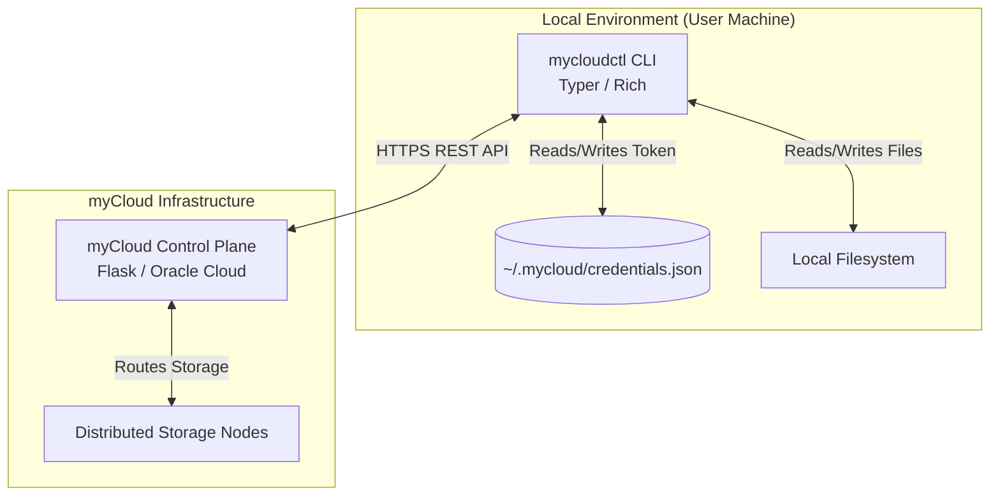

  
  <h1>myCloud CLI (mycloudctl)</h1>
  
<em>The official, high-performance command-line interface for the myCloud ecosystem.</em>

  

    <a href="https://pypi.org/project/mycloudctl/"><strong>PyPI Package</strong></a> |
    <a href="https://cloud.mysphere.co.in"><strong>myCloud Web</strong></a>
  

  
  
  

---

## Executive Summary

**mycloudctl** is the official command-line interface for **myCloud**. Built for power users, developers, and system administrators, the CLI provides seamless terminal access to the distributed myCloud storage platform. It translates complex API interactions into intuitive, fast, and secure terminal commands.

---

## Project Highlights

- **Terminal UI (TUI):** Beautiful, color-coded terminal interfaces built with `Rich`, featuring live progress bars, dynamic tables, and tree views.
- **Robust Argument Parsing:** Built on top of `Typer` for strict type-checking, intuitive subcommands, and auto-completion generation.
- **Asynchronous Operations:** Efficient handling of bulk file uploads, downloads, and batch sharing.
- **Standalone Binaries:** Available as a standard Python package via PyPI or as a zero-dependency standalone executable compiled with `PyInstaller`.
- **Node Management:** Native commands to register and manage your private myCloud storage nodes directly from the terminal.

---

## Overview

### What mycloudctl Does
`mycloudctl` allows users to perform all myCloud operations without leaving their terminal. From basic file operations (`ls`, `upload`, `download`, `rm`) to advanced ecosystem features (`stash`, `batch share`, `nodes`), everything is one command away.

### Target Users
Developers, Linux enthusiasts, and server administrators who prefer scriptable, keyboard-driven workflows over graphical interfaces.

### Core Philosophy
- **Speed & Efficiency:** Commands should be short, memorable, and execute instantly.
- **Visual Clarity:** Terminal output shouldn't be boring. `mycloudctl` heavily utilizes colors, emojis, and structured tables to make data readable.
- **Security:** Credentials must be handled securely via robust local authentication flows.

---

## System Architecture

The CLI acts as a thick client, managing local state and communicating with the myCloud Control Plane via a RESTful API facade.

### Architecture Highlights:
- **Authentication State:** `mycloud login` securely exchanges credentials for an API token, storing it in `~/.mycloud/credentials.json`. Subsequent commands automatically inject this token into the `Authorization` header.
- **Modular Command Groups:** Commands are grouped logically (e.g., `mycloud files`, `mycloud stash`, `mycloud share`) using Typer sub-applications for maintainability.
- **API Facade:** The CLI relies heavily on the `mycloud-sdk` core logic, serving primarily as a UI layer to translate user input into SDK function calls.

---

## Command Reference

The CLI commands are grouped by functionality:

### ▸ Authentication
Manage your myCloud session and account.
- `mycloud login [--username <user>] [--password <pass>]`: Sign in to your account.
- `mycloud logout`: Sign out and clear stored session credentials.
- `mycloud whoami`: Display the currently authenticated user and session details.
- `mycloud register`: Register a new myCloud account directly from the terminal.
- `mycloud forgot-password`: Request a password reset email from the terminal.
- `mycloud reset-password`: Submit a reset token and set a new password.

### ▸ File Operations
Core file management capabilities. Append `--node <node_id>` to target specific private storage nodes.
- `mycloud ls [folder_id] [--node <node_id>] [--favorites] [--tree]`: List files and folders.
- `mycloud upload <file_path> [--folder <id>] [--node <node_id>] [--stash] [--days <int>]`: Upload a file to your cloud.
- `mycloud download <file_id> [--output <path>]`: Download a specific file by its ID.
- `mycloud download-all [folder_id] [--node <node_id>] [--output <dir>]`: Download all files in a folder (or node).
- `mycloud rm <file_id> [--yes]`: Delete a file.
- `mycloud rm-all [folder_id] [--node <node_id>] [--yes]`: Delete all files in a folder or node.
- `mycloud rename <file_id> <new_name>`: Rename an existing file.
- `mycloud mv <file_id> <folder_id>`: Move a file into a different folder.
- `mycloud info <file_id>`: Show detailed metadata for a file (size, MIME type, storage node, timestamps).
- `mycloud cat <file_id>`: Print the contents of a text file directly to standard output.
- `mycloud favorite <file_id>` (or `mycloud fav <file_id>`): Toggle favorite status of a file.
- `mycloud favorites` (or `mycloud favs`): View all favorited files.

### ▸ Folder Operations
Organize files using hierarchical directories.
- `mycloud mkdir <name> [--parent <id>] [--node <node>]` (or `mycloud folders mkdir`): Create a new folder.
- `mycloud rmdir <folder_id> [--yes]` (or `mycloud folders rm`): Delete a folder and its contents.
- `mycloud folders rename <folder_id> <new_name>`: Rename a folder.
- `mycloud folders mv <folder_id> <new_parent_id>`: Move a folder into a new parent directory.
- `mycloud folders info <folder_id>`: View details, subfolders, and file lists for a directory.
- `mycloud folders download <folder_id> [--output <path>]`: Download an entire folder as a zip archive.
- `mycloud folders favorite <folder_id>`: Toggle favorite status of a folder.

### ▸ Search
Find files across your cloud by name.
- `mycloud find <query> [--limit <n>]`: Search for files and folders matching a query.

### ▸ Stash (Temporary Lifecycle Storage)
Manage temporary files with scheduled retention lifecycles.
- `mycloud stash ls`: List all items currently in your stash with expiry dates.
- `mycloud stash add <file_ids...> [--days <int>]`: Move file(s) into temporary stash with auto-expiry.
- `mycloud stash pop <file_ids...>`: Restore stashed file(s) back into active cloud storage.
- `mycloud stash empty [--yes]`: Permanently purge all stashed files.

### ▸ Sharing & Invitations
Share files and folders directly with users or generate public links.
- `mycloud share send <item_id> --user <username/email> [--folder] [--permission read|write]`: Share an item with a registered user.
- `mycloud share link <item_id> [--folder]`: Generate a public URL link for an item.
- `mycloud share disable-link <item_id> [--type file|folder]`: Revoke a public share link.
- `mycloud share info <item_id> [--type file|folder]`: View active shares and permission levels.
- `mycloud share update-perm <item_id> --user-id <id> --permission <read|write> [--type file|folder]`: Update user access permission.
- `mycloud share rm <item_id> [--type file|folder] [--with-id <id>]`: Remove access permissions.
- `mycloud share copy <file_id>`: Copy an incoming shared file into your personal storage.
- `mycloud share copy-folder <folder_id>`: Copy an incoming shared folder into your personal storage.
- `mycloud share with-me`: List all files and folders shared with you.
- `mycloud share invites`: List pending inbound share invitations.
- `mycloud share accept <token>`: Accept an invitation to access shared content.
- `mycloud share decline <token>`: Decline an incoming invitation.
- `mycloud share mute <identifier>`: Mute invitations from a specific user or email.
- `mycloud share unmute <muted_user_id>`: Unmute invitations from a user.
- `mycloud share muted`: List all currently muted users.

### ▸ Batch Operations
Execute multi-file operations efficiently in a single step.
- `mycloud batch link <ids...>`: Generate a single public share link containing multiple files.
- `mycloud batch download <ids...> [--output <dir>]`: Download multiple files bundled in a zip archive.
- `mycloud batch move <ids...> --dest <folder_id>`: Move multiple files to a folder.
- `mycloud batch delete <ids...> [--yes]`: Delete multiple files in one operation.
- `mycloud batch share <ids...> --user <email/user> [--permission read|write]`: Share multiple files with a user.
- `mycloud batch stash <ids...> [--days <int>]`: Stash multiple files at once with retention expiry.
- `mycloud batch unstash <ids...>`: Restore multiple stashed files simultaneously.
- `mycloud batch unshare <ids...>`: Revoke all shares across multiple files.
- `mycloud batch copy-shared <ids...>`: Copy multiple shared files to your cloud storage.

### ▸ Private Storage Nodes
Coordinate physical machines as private storage nodes.
- `mycloud servers ls`: List all registered storage nodes, status, and free capacity.
- `mycloud servers add [--name <name>] [--port <port>] [--storage-path <path>]`: Register a new storage node.
- `mycloud servers rm <server_id>`: Remove a registered storage node from the control plane.

### ▸ Storage & Stats
Monitor account limits and disk utilization.
- `mycloud stats` (or `mycloud storage stats`): Display quota usage, bar charts, and object counts.
- `mycloud storage nuke [--yes]`: Wipe all account files, folders, and stash after confirmation.

### ▸ Notifications
Track account events and shared file activities.
- `mycloud notify ls [--limit <n>]`: Display recent notifications.
- `mycloud notify read [ids]`: Mark notifications as read (omit IDs to mark all read).
- `mycloud notify hide <ids>`: Permanently hide notifications.

### ▸ Profile & Preferences
Manage account security, personal details, and client settings.
- `mycloud profile show`: Display username, email, 2FA status, and membership info.
- `mycloud profile update [--name <str>] [--username <str>]`: Update profile information.
- `mycloud profile 2fa [--enable/--disable]`: Toggle two-factor authentication.
- `mycloud profile avatar-upload <image_path>`: Upload a new profile picture.
- `mycloud profile avatar-rm`: Remove your profile picture.
- `mycloud profile delete-account [--yes]`: Permanently delete your account and data.
- `mycloud prefs show`: Display user interface and behavior preferences.
- `mycloud prefs set <key> <value>`: Update a preference key.
- `mycloud prefs sync`: Synchronize local client settings with cloud preferences.

---

## Technology Stack

| Category | Technology |
| --- | --- |
| **Language** | Python 3.10+ |
| **CLI Framework** | Typer (Click) |
| **Terminal UI** | Rich |
| **HTTP Client** | HTTPX |
| **Packaging** | PyInstaller, setuptools, build |

---

## Engineering Challenges

1. **State Management in Stateless CLI:** Designing an authentication flow that securely persists JWT tokens across isolated terminal command executions.
2. **Binary Compilation:** Configuring `PyInstaller` `.spec` files to properly bundle hidden imports dynamically required by `Typer` and `Rich`, ensuring the standalone `.exe` runs without Python installed.
3. **Chunked Transfers:** Implementing reliable, visually accurate progress bars using `Rich.Progress` while streaming large file uploads/downloads via `HTTPX` without loading the entire file into RAM.

---

## Repository Scope

> **IMPORTANT NOTICE:** 
> This repository is intended exclusively as a **project showcase and portfolio piece**. 
> 
> To protect proprietary business logic and the core source code, **the actual application logic is not published here**. This README serves to demonstrate the architectural design and professional standards applied during the development of the myCloud CLI.

---

## Contact & Links

- **Email:** kanhaiffco2007@gmail.com
- **LinkedIn:** [linkedin.com/in/rudransh-shekhar](https://linkedin.com/in/rudransh-shekhar)
- **Portfolio:** [rudransh-shekhar.netlify.app](https://rudransh-shekhar.netlify.app)
- **PyPI Package:** [mycloudctl](https://pypi.org/project/mycloudctl/)
- **Live Platform:** [cloud.mysphere.co.in](https://cloud.mysphere.co.in)
- **Ecosystem Hub:** [mysphere.co.in](https://mysphere.co.in)
- **GitHub:** [github.com/rudy-07](https://github.com/rudy-07)

  
Built with passion and engineering rigor. © 2026

